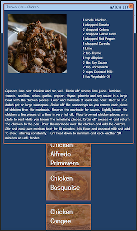

# Endless Ingredients

The purpose of this project is to allow the user to search recipes with certain ingredients (up to 3).

## Description

Have you ever had something in your fridge that you needed to cook, but you just couldn't think of what you wanted to make? Especially with the pandemic, trying to be less wasteful and use all of the ingredients you have on hand is a real concern. With this project, we search a recipe API to utilize the ingredients specified by the user.

## Motivation

With the pandemic, I often find myself trying not to go the store. And since we are always cooking at home, we are constantly wanting to find new recipes to make from the ingredients we have. Therefore, I wanted a way to easily search through recipes with the ingredients I have one hand.

## Challenges and Solutions

A few challenges we faced were:

- being able to search for multiple ingredients in the same recipe
  - We solved this problem by creating an object, storing the recipe id's in an array, and using the object to count how many times each id is present in the original array. If the id occurs the same number as the input fields, it gets pushed into an array that we use to populate the recipes.
- creating responsiveness in the main search page as well as the modal
  - We used a combination of flex-box and grid with media queryies to make the page responsive.

## Screenshots

     

## Features

- users can add ingredient input fields and remove them
- users have access to the ingredients in the api through a dropdown datalist the appears when the input fields is selected.
- users have access to a photo of the final dish, the ingredients, the recipe, and a link to a video of the recipe being prepped.
- users also have access to drink suggestions that populate in the top banner as compliment to their meal
  -These drink suggestions, when clicked, present a modal with an image, ingredients, and a recipe for the drink.

## API Reference

Recipe API: https://www.themealdb.com/api.php

Drink API: https://www.thecocktaildb.com/api.php

## Credits

This was a group project with Hilda (https://github.com/hpatrob82) and Josh (https://github.com/jcook071990).
